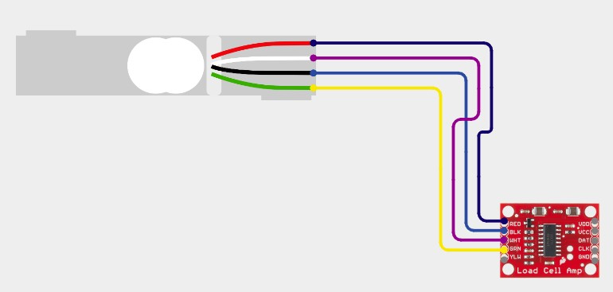
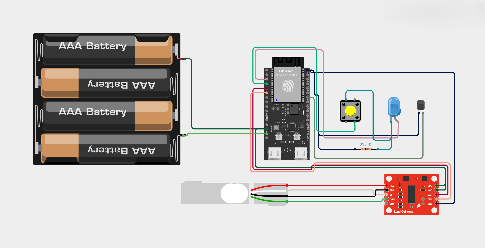
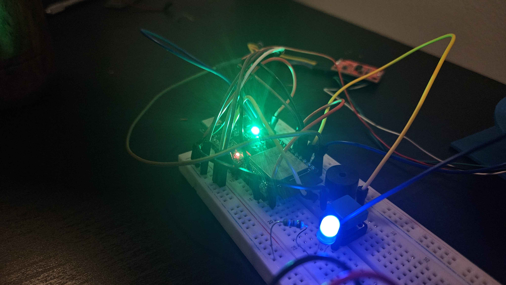
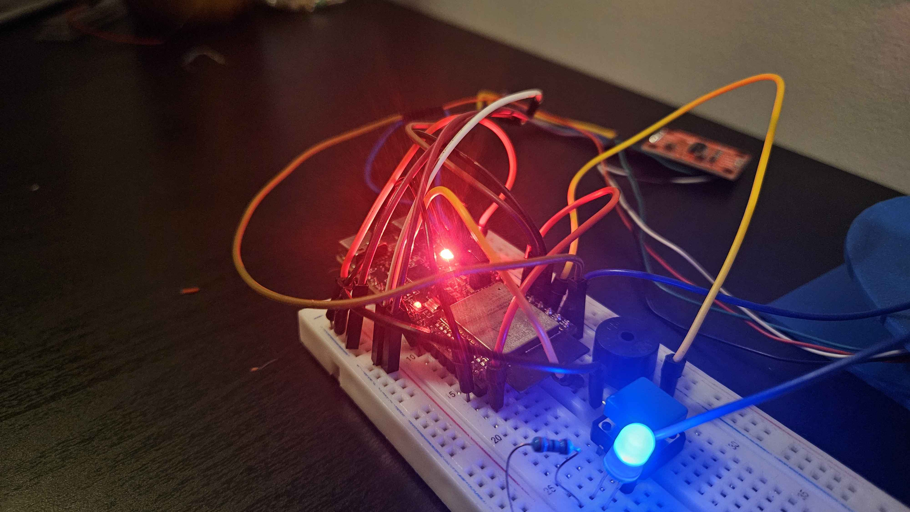
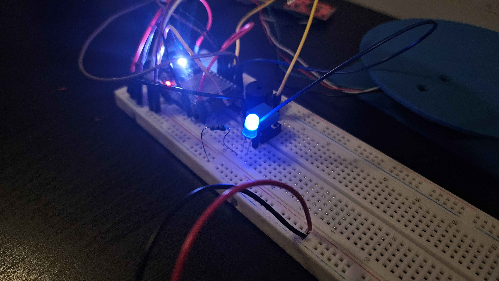
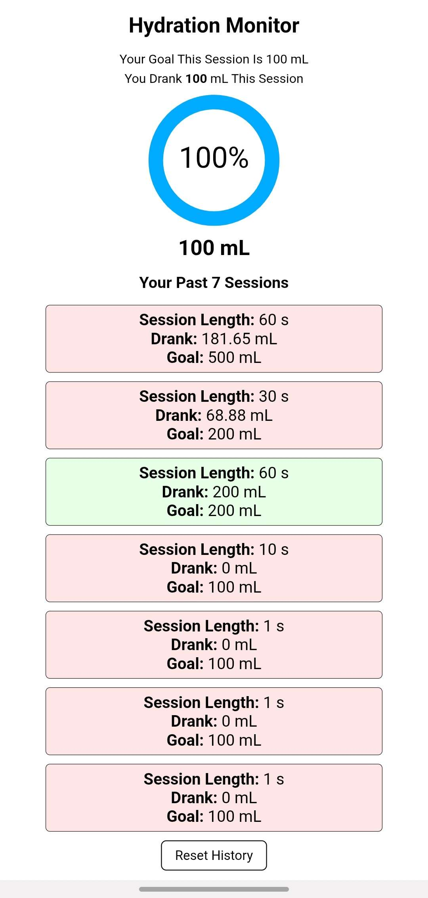
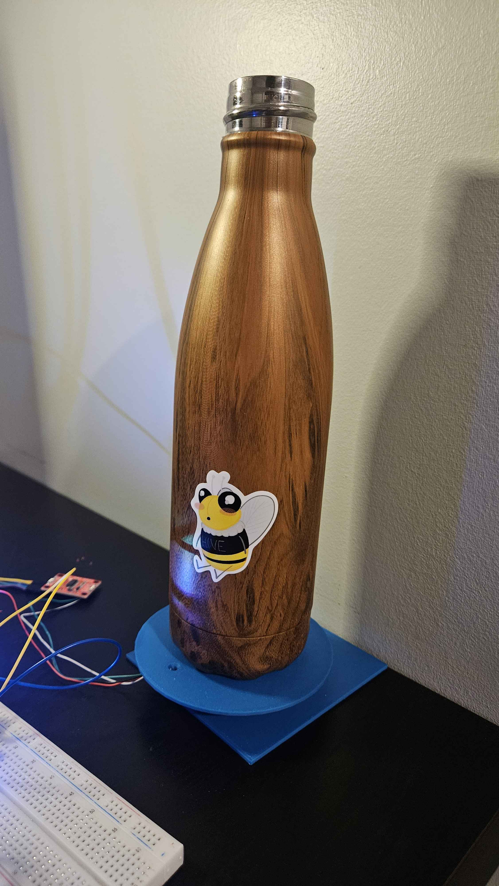
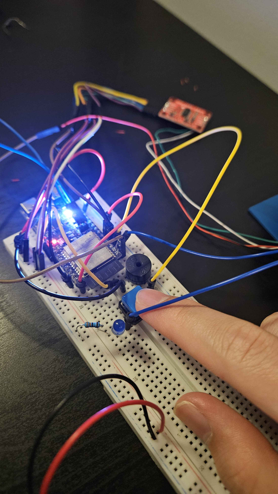

# Hydration Tracker Using ESP32 Microcontroller
Created by Rohan

## Table of Contents
* [Report](#report)
* [Hardware Setup](#hardware-setup)
* [Code](#code)
* [Media](#media)
* [Citations](#citations)

## Report

### Quick Overview
The Hydration Tracker is a smart water bottle scale that helps users maintain proper hydration throughout the day. The device monitors water consumption in real-time, provides visual feedback on hydration status through the onboard LED and the website it hosts, and logs historical data for tracking progress over time.

### Component Overview
For the Hydration Tracker hardware, the following components are required:
* ESP32-C6-DevKitC-1 Microcontroller
  * The ESP32C6 contains the logic for the system and interacts with the other peripherals such as the buzzer to provide meaningful functionality.
  * Additionally, the onboard LED of the ESP32C6 acts as a visual indicator, showing white for when the system is waiting for user input for a session, red when the user is substantially behind their ideal hydration level during the session, yellow when the user is slightly behind their ideal hydration level during the session, green when the user is ahead of their ideal hydration level during the session, and purple when the user is at or surpasses their hydration goal for the session.
* HX711 Load Cell Amplifier
  * The load cell amplifier amplifies the tiny voltage offsets from the load cell into a more useable range of voltage that correlates to weight readings.
* Load Cell (5kg capacity)
  * The load cell measures strain along itself and outputs it as a change in voltage. The change in strain is measurable as a change in weight.
* Blue LED
  * The blue LED provides visual feedback to when the system is hosting the webpage. When the LED is on, the user is able to access the webpage.
* Button
  * The button tells the system to turn on WiFi capabilities so that the user can connect to it and view the webpage that the system hosts.
* Buzzer
  * The buzzer audibly notifies the user that they need to drink water to stay on track with their hydration goal for the session.
* Battery Pack
  * The battery pack is necessary to power on the system in a portable manner.
* Breadboard
  * The breadboard is necessary to easily connect all components together.
    
 ### Challenges Faced
 - Task running out of stack storage, which was solved by allocating more of the stack to the task
 - Getting NVS to work and store the session data
 - Separating the project into independent modules
 - External RGB LED had many flaws, had to switch to onboard LED
 - Had problems implementing sleep mode since the system would not register scale readings in sleep, making the system unresponsive and frustrating. To somewhat still save power, we implemented the web server button since WiFi was the peripheral that took up the most power.

### Similarities and Differences to Other Real-World Embedded Systems
The system is similar to other embedded systems in several areas, such as interactivity, responsive, and power. Some real-world embedded systems are interactive and have buttons, such as a car's AC system, that allow the user to use the system. Additionally, real-world embedded systems are responsive, meaning that clicking a button doesn't have a noticeable delay. The Hydration Monitor promotes user interactivity by hosting a web server where users can view and reset their hydration data. The web server button is connected to an interrupt, making it responsive as well. Real-world embedded systems should also be conservative in power as most of these systems run on an external battery. In this project, the system is able to disable web server and WiFi capabilities after it senses no clients for a set time, thus saving power. A major difference between this system and other real-world embedded systems is size. Most embedded systems implement a custom PCB to minimize the size of their system. This project on the other hand uses a breadboard and long wires that greatly increases its size, making it inconvenient to carry around and use.

### Improvements
Given more time and resources, some improvements could be
- Making UI/UX on website better
- Constructing scale with better materials and adding more structural support to stabilize scale when heavy objects are placed on it
- Implementing better logic to reliably detect hydration intake since some hydration intakes did not go through
- Soldering and reducing wire usage
- Creating custom PCB instead of ESP32 board

## Hardware Setup

### Wiring

| ESP32-C6 Pin | HX711 | Blue LED| Speaker | Push Button | Power |
| :----------: | :---: | :-----: | :-----: | :---------: | :---: |
| 5V           | VCC   |         |         |             |   +   | 
| GND          | GND   | Cathode |    -    |     GND     |   -   |
| GPIO 4       |       |  Anode  |         |             |       |
| GPIO 5       |       |         |         |   Signal    |       |
| GPIO 6       | DAT   |         |         |             |       |
| GPIO 7       | CLK   |         |         |             |       |
| GPIO 21      |       |         |    +    |             |       |

**Load Cell Wiring:**
### 

- E+ → RED
- E- → BLK
- A- → WHT
- A+ → GRN

**Circuit Diagram:**
### 

### Assembly Notes

The load cell should be mounted in a stable configuration to accurately measure the weight of the water bottle. We recommend:
1. Securing the load cell to a flat, rigid base
2. Creating a platform on top of the load cell for the water bottle to rest on
3. Ensuring the load cell is calibrated before first use (calibration value in `config.h`)

The blue LED serves as a web server status indicator:
- **Solid Blue**: Web server enabled
- **Off**: Web server disabled

The onboard LED provides hydration status feedback:
- **Green**: On track with hydration goals
- **Yellow**: Falling behind, should drink soon  
- **Red**: Critical, need to drink immediately

## Code

### Module Architecture

The codebase is organized into modular components, each handling a specific aspect of the system:

#### **config.h**
Central configuration file containing:
- Pin definitions for all hardware components
- Calibration values for the load cell
- LED state definitions for different hydration levels
- Storage configuration for historical data

#### **scale.cpp / scale.h**
Handles the HX711 load cell interface:
- Initializes the HX711 with calibration values
- Reads weight measurements with stability checking
- Calculates delta (change in weight) to detect water consumption
- Implements filtering to reduce noise

#### **hydration.cpp / hydration.h**
Manages hydration tracking logic:
- Tracks total water consumed vs. session goal
- Calculates ideal consumption rate over time
- Determines hydration state (HYDRATED, NEEDS_WATER, CRITICAL)
- Updates status based on consumption pattern
- Provides reset functionality for new session periods

#### **status_led.cpp / status_led.h**
Controls the onboard LED feedback:
- Initializes the ESP32-C6 onboard LED
- Maps hydration states to LED patterns:
  - **Green**: On track with hydration
  - **Yellow**: Falling behind, should drink soon
  - **Red**: Critical, need to drink immediately
  - **Purple**: Met/exceeded session goal
- Provides visual status at a glance

#### **speaker.cpp / speaker.h**
Manages audio alerts:
- Generates tone alerts using PWM
- Plays periodic reminders when hydration is critical
- Implements alert timing to avoid annoyance
- Can be silenced when hydration improves

#### **storage.cpp / storage.h**
Handles non-volatile memory operations:
- Stores up to 7 sessions using NVS (Non-Volatile Storage)
- Each session saves daily consumption data with session lengths
- Provides data retrieval for web interface

#### **web.cpp / web.h**
Implements WiFi access point and web server:
- Creates a WiFi hotspot (SSID: "Hydration Tracker")
- Serves HTML page with real-time hydration data
- Provides AJAX endpoints for live updates
- Displays historical consumption in table format
- Allows users to reset tracking data
- Can be toggled on/off via push button

#### **4180.ino**
Main program file that:
- Initializes all hardware modules
- Creates FreeRTOS tasks for concurrent operation:
  - `taskReadScale`: Monitors scale for weight changes (every 100ms)
  - `taskUpdateStatusLED`: Updates onboard LED based on hydration state (every 2s)
  - `taskAlertUser`: Triggers speaker alerts when needed (every 1s)
  - `taskHTMLPage`: Handles web server requests (every 10ms)
  - `taskWiFiControl`: Manages WiFi button and blue LED status
- Manages end-of-day data logging and resets

## Media

### System Overview

*Fully assembled hydration tracker with ESP32-C6, load cell, blue WiFi LED, push button, and speaker*

### Hardware Components

*Wiring diagram showing connections between ESP32-C6, HX711, and peripherals*

### LED Status Indicators

*Green onboard LED indicating good hydration status*

*Yellow onboard LED indicating user should drink soon*

*Red onboard LED indicating critical hydration status*

*Blue LED indicating WiFi is active and web interface is accessible*

### Web Interface

*Web interface showing current hydration level and 7-day history*

### Device in Use

*Water bottle positioned on the load cell platform*

*Push button for toggling WiFi connectivity*

  
## Citations
- Arduino.h: https://github.com/espressif/arduino-esp32
- Wifi.h: https://github.com/espressif/arduino-esp32/tree/master/libraries/WiFi
- HX711.h: https://github.com/RobTillaart/HX711
- Adafruit_NeoPixel.h: https://github.com/adafruit/Adafruit_NeoPixel
- nvs_flash.h: https://github.com/espressif/esp-idf/blob/master/components/nvs_flash/include/nvs_flash.h
- nvs.h: https://github.com/espressif/esp-idf-nvs-partition-gen
- FreeRTOS (built-in): https://docs.espressif.com/projects/esp-idf/en/stable/esp32/api-reference/system/freertos.html
